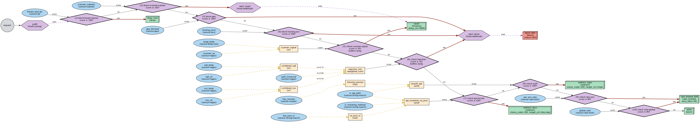

# Ferrum

A proof-of-concept WAF built on [Pingora](https://github.com/cloudflare/pingora) where every rule produces a **score from 0 to 100** instead of a binary block/pass decision.

---

## The problem with traditional WAFs

ModSecurity, AWS WAF, and most commercial WAFs share the same mental model: a request either _matches_ a rule or it doesn't. This works well for known-bad signatures but breaks down in practice:

- A single SQLi pattern fires → block. Even if the same string appears in a developer's API test.
- Geo-blocking is all-or-nothing: you either block a country or you don't.
- Rules are independent. Two medium-confidence signals that together mean "definitely malicious" can't be combined without writing new rules.
- ModSecurity runs its full ruleset on **every** request, whether it's a static asset or a suspicious POST to `/admin`.

The result: you tune thresholds globally, accept false positives, and disable rules that cause too much noise.

---

## How Ferrum works differently

Ferrum treats threat detection as a **scoring problem**, not a pattern-matching problem.

Every **sensor** returns a score in `[0, 100]`:

```
known bad IP → 100      geo: blocked country → 100
scanner User-Agent → 80    SQLi in body → 67
request from GCP ASN → 40   body size 200 KB → 30
```

**Transformers** compose scores with fuzzy logic:

```
injection_risk = weighted_sum(sqli=0.7, xss=0.5, path_traversal=0.8)
scanner_signal = or(scanner_ua, large_body)      ← max of the two
unauth_api     = and(is_api_path, missing_session) ← min of the two
```

**Rules** form a DAG — each rule evaluates one sensor/transformer and branches:

```toml
[[rules]]
id          = "check-injection"
input       = "injection_risk"
threshold   = 34          # fire when score ≥ 34
if_action   = "block_403"
else_action = "check-auth"
```

The DAG traversal is the request pipeline. Cheap sensors (IP blocklist, geo) run first. Expensive checks (regex on body, rate limiting, and eventually ModSecurity) only run when lighter checks don't produce a verdict.

---

## Example: a minimal config

```toml
entry = "check-sqli"

[server]
listen   = "0.0.0.0:8080"
upstream = "127.0.0.1:3000"

[sensors.sqli_uri]
plugin   = "sensor-regex"
target   = "uri"
patterns = ["(?i)union.{0,20}select", "(?i)drop.{0,20}table"]

[sensors.sqli_body]
plugin   = "sensor-regex"
target   = "body"
patterns = ["(?i)union.{0,20}select", "(?i)drop.{0,20}table"]

[transformers.sqli]
plugin = "or"
inputs = ["sqli_uri", "sqli_body"]

[terminators.block_403]
plugin = "block"
status = 403

[[rules]]
id          = "check-sqli"
input       = "sqli"
threshold   = 50
if_action   = "block_403"
buffer_body = true
```

The full example config covering IP blocklists, geo, ASN, scanner detection, injection, auth, and rate limiting is in [ferrum.toml](ferrum.toml).

---

## Rule graph

Visualised with `make graph` (requires [Graphviz](https://graphviz.org)):



---

## What Ferrum is good at

- **Layered risk scoring.** Combine weak signals into a strong verdict without writing boolean combinators by hand.
- **Prioritised pipeline.** Put cheap sensors first, expensive ones last. A known-bad IP is dropped in microseconds; SQLi regex only runs if nothing else matched.
- **Extensible without touching core.** Plugins self-register via `inventory::submit!`. Drop a crate into `plugins/`, rebuild with `xferrum build` — no changes to Ferrum itself.
- **Composable logic.** `and`, `or`, `not`, `weighted_sum` transformers let you express things like _"flag if from a hosting ASN **and** no session cookie **and** large body"_ directly in config.

## What Ferrum is not (yet)

- **Production-ready.** This is a proof-of-concept. There is no hot config reload, no clustering, no persistent state across restarts.
- **A ModSecurity replacement out of the box.** No OWASP CRS is bundled. The architecture supports adding ModSecurity as a plugin at the end of the DAG, which is the intended path.
- **Zero-config.** You need to write a TOML config. There is no rule auto-generation.

---

## Quick start

```bash
# 1. Build (requires Rust stable + Cargo)
make build          # → ./target/debug/ferrum

# 2. Run with the example config
./target/debug/ferrum --config ferrum.toml

# Prometheus metrics
curl http://localhost:9090/metrics
```

The proxy listens on `:8080`, upstream defaults to `127.0.0.1:8081`.

---

## Docker (xferrum builder image)

`xferrum` is the build tool — analogous to [xcaddy](https://github.com/caddyserver/xcaddy) for Caddy. The builder image bundles the Rust toolchain, xferrum, and the Ferrum workspace so you don't need Rust installed locally.

```dockerfile
FROM ghcr.io/your-org/xferrum:latest AS builder
# Optionally add external plugins:
# RUN xferrum build --plugin github.com/you/my-sensor --output /ferrum
COPY ./plugins /build/plugins
RUN xferrum build --output /ferrum

FROM debian:bookworm-slim
COPY --from=builder /ferrum /usr/local/bin/ferrum
COPY ferrum.toml /etc/ferrum/ferrum.toml
CMD ["ferrum", "--config", "/etc/ferrum/ferrum.toml"]
```

To build the `xferrum` image itself:

```bash
docker build -t xferrum .
```

---

## Plugins

### Sensors

| Plugin                | What it scores                                                     |
| --------------------- | ------------------------------------------------------------------ |
| `sensor-ip`           | Exact IP match against a blocklist → 0 or 100                      |
| `sensor-subnet`       | CIDR match → 0 or 100                                              |
| `sensor-geo`          | MaxMind GeoIP country → 0 or 100                                   |
| `sensor-asn`          | MaxMind ASN match (e.g. cloud hosting) → 0 or 100                  |
| `sensor-regex`        | Fraction of patterns matched in URI / body / header                |
| `sensor-string-match` | Field comparison (eq / prefix / suffix / contains) → 0 or 100      |
| `sensor-cookie`       | Cookie presence or value match → 0 or 100                          |
| `sensor-body-size`    | Linear interpolation between `min_bytes` → 0 and `max_bytes` → 100 |
| `sensor-rate-limit`   | `(request_count / limit)`, clamped to 100                          |

### Transformers

| Plugin         | Score                                                                    |
| -------------- | ------------------------------------------------------------------------ |
| `or`           | `max(inputs)` — fuzzy OR                                                 |
| `and`          | `min(inputs)` — fuzzy AND                                                |
| `not`          | `100 − score` — fuzzy NOT                                                |
| `weighted_sum` | `Σ(weight × score)`, clamped to 100                                      |
| `clamp`        | Linearly remaps sub-range `[low, high]` of one input score to `[0, 100]` |

### Terminators

| Plugin            | Action                                                         |
| ----------------- | -------------------------------------------------------------- |
| `block`           | Respond with a configurable HTTP status code                   |
| `pass` / `bypass` | Allow request through to upstream                              |
| `drop`            | Close the TCP connection without responding                    |
| `redirect`        | Respond with 301/302 and a `Location` header                   |
| `rate_limited`    | Respond with 429 and a `Retry-After` header                    |
| `timeout`         | Hold the connection open for `delay_ms` then drop (tarpitting) |

### Hooks

Hooks fire non-blocking side-effects and continue to the next action:

| Plugin         | What it does                                                     |
| -------------- | ---------------------------------------------------------------- |
| `hook-syslog`  | Emit audit event to syslog                                       |
| `hook-webhook` | POST audit event (including `current_score`) to an HTTP endpoint |

---

## Writing a plugin

Implement one of the four traits (`Sensor`, `Transformer`, `Hook`, `Terminator`) from `ferrum-sdk` and call `inventory::submit!`:

```rust
use ferrum_sdk::{Plugin, RequestContext, Score, Sensor, SensorFactory};

struct MySensor;
impl Plugin for MySensor {}

impl Sensor for MySensor {
    type Args = ();
    fn compile_args(&self, _: &ferrum_sdk::toml::Value) -> () { () }
    fn evaluate(&self, _ctx: &mut RequestContext, _: &()) -> Score { Score(42) }
}

ferrum_sdk::inventory::submit! {
    SensorFactory { name: "my-sensor", build: |args, id| MySensor.into_entry(args, id) }
}
```

Then: `xferrum build --plugin ./my-sensor --output ./ferrum`.

---

## Development

```bash
make build       # debug binary via xferrum → ./target/debug/ferrum
make release     # optimised binary → ./target/release/ferrum
make test        # unit + integration tests (excludes e2e)
make test-e2e    # build binary, spawn it, run HTTP tests
make lint        # clippy --workspace -- -D warnings
make graph       # render ferrum.toml → ferrum.png (requires graphviz)
```

### Environment variables

| Variable      | Default                 | Description                                        |
| ------------- | ----------------------- | -------------------------------------------------- |
| `FERRUM_PATH` | auto-detect             | Path to the `ferrum` library crate (for `xferrum`) |
| `FERRUM_BIN`  | `./target/debug/ferrum` | Binary path used by `make test-e2e`                |
| `RUST_LOG`    | `info`                  | Log filter, e.g. `ferrum=debug`                    |

---

## Observability

Structured JSON audit log on stdout (one entry per rule evaluation) and Prometheus metrics on `:9090/metrics`:

| Metric                       | Type      | Labels    |
| ---------------------------- | --------- | --------- |
| `waf_requests_total`         | counter   | `action`  |
| `waf_rule_score`             | histogram | `rule_id` |
| `waf_body_buffer_size_bytes` | histogram | —         |
